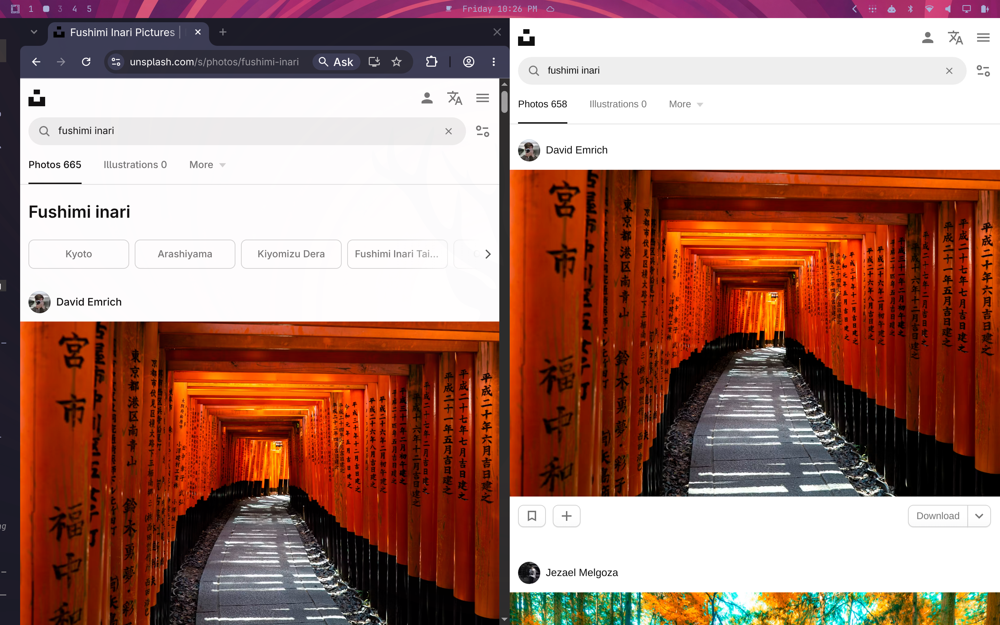

# Shinto


*Chrome on the left, Shinto on the right.*

*Chrome has too much chrome; Zen isn't zen enough.*

*Shinto renders unto the window management gods what is theirs.*

A page viewer for Omarchy. One window is one document. Hyprland is the tab bar.

Zen reimplements workspaces, split view, and tabs inside the browser because most desktops are bad at those. Omarchy is not. Shinto is the shrine: a gate you walk through (the overlay omnibox) and then it is gone.

A small native C++/Qt6 app embedding QtWebEngine (`app/`) — not a Chrome extension driving real Chromium. There is no tab strip and no New-Tab-Page to fight with: the omnibox is a widget Shinto draws itself, never a page Chromium could show its own UI on top of.

## Why it starts fast

The app itself is the warm daemon — no separate hidden window needed to keep it alive. `shinto.service` runs it with zero windows open; opening a page asks the already-running process for a new window over a local socket. Warm opens measure well under 150ms, not seconds.

## What Shinto is (and is not)

| Is | Is not |
|----|--------|
| Default *page* browser (links, Super+Shift+B once set) | Omarchy webapp host (`--app=` stays on Chromium) |
| One window per page; Hyprland groups are tabs | An extension platform |
| Theme-aware omnibox via Omarchy hooks | A full Chrome/Firefox replacement for every workflow |

Chromium remains the right tool for Omarchy web apps and bundled Chromium extensions. Shinto is for reading the web on a tiling compositor.

## Install

### From source (Omarchy / Hyprland)

```bash
git clone https://github.com/ijt/shinto.git
cd shinto
cmake -S app -B app/build
cmake --build app/build
cd downloads-tui && cargo build --release && cd ..
./shinto install
```

The `cargo build` is for the downloads view (`shinto-downloads`, a separate
Rust/Ratatui binary -- see [`downloads-tui/`](downloads-tui/)) opened by
Ctrl+J or clicking the bottom progress bar; skip it and Shinto still works
fine as a browser, that one view just won't open. `./shinto install` will:

- symlink `~/.local/bin/shinto` (and `~/.local/bin/shinto-downloads`, if built)
- enable `shinto.service` so the daemon is warm after login
- rebind `Super + Shift + Return` to Shinto and `Super + Shift + Y` to YouTube in Shinto
- tag Shinto windows like other Chromium-family browsers

`Super + Shift + B` and `xdg-open` stay on Chromium unless you opt in with `shinto default`.

```bash
./shinto uninstall   # data is left in ~/.local/share/shinto
```

### Packaged (AUR)

A `shinto-git` PKGBUILD lives in [`packaging/`](packaging/). Build/install:

```bash
cd packaging
makepkg -si
systemctl --user enable --now shinto.service
xdg-settings set default-web-browser shinto.desktop
```

Once Omarchy lists Shinto under *Install > Browser*, the intended path is:

```bash
omarchy install browser shinto
omarchy default browser shinto
```

### System install layout (`cmake --install`)

```
/usr/bin/shinto
/usr/share/applications/shinto.desktop
/usr/share/icons/hicolor/128x128/apps/shinto.png
/usr/lib/systemd/user/shinto.service
```

`shinto-downloads` isn't part of this -- it's a separate Cargo build (see
[`downloads-tui/`](downloads-tui/)), not yet wired into `cmake --install`
or the AUR `PKGBUILD`. `./shinto install` handles it for a from-source
install (see above); packaging it properly is still open work.

## Keys

Browser (inside a Shinto window):

| Key | Action |
|-----|--------|
| `Ctrl + T` / `Ctrl + N` | New empty page (new window) |
| `Ctrl + L` / `Ctrl + K` | Edit this window's address (whole address selected, so typing replaces it). Escape goes back. |
| `Alt + Left` | Back (configurable, see [Configuration](#configuration)) |
| `Ctrl + F` | Find in page. Enter/Shift+Enter or the ↓/↑ buttons step through matches, Escape closes it. |
| `Ctrl + R` | Reload the page |
| `Ctrl + J` | Open the downloads view (`shinto-downloads`, a terminal UI) -- also opens by clicking the bottom progress bar shown while a download is active |
| `Ctrl + W` / `Super + Q` | Close this page |

Hyprland groups (these are the tabs):

| Key | Action |
|-----|--------|
| `Super + G` | Toggle group on the focused window. New windows join an unlocked group. |
| `Super + Ctrl + Left/Right` | Cycle pages in the group |
| `Super + Alt + 1/2/3/4` | Jump to grouped window N |
| `Super + Alt + G` | Pull this window out of the group |
| `Super + G` again | Disband the group |

## Configuration

Shinto reads `~/.config/shinto/config.lua` (a real Lua file, executed with an embedded Lua 5.4 interpreter) fresh every time a new window opens — no restart needed, even against a daemon that's been running for days; just open a new window (`Ctrl+T`/`Ctrl+N`, or `Super+Shift+Return`) after editing the file. Two settings so far:

```lua
-- Search fallback for whatever the omnibox doesn't recognize as a URL.
-- "%s" is replaced with the percent-encoded query. Defaults to DuckDuckGo
-- (below) if config.lua doesn't set this, or doesn't exist at all.
search_engine = "https://www.google.com/search?q=%s"

-- Browser-back shortcut, as a Qt key-sequence string. Defaults to
-- Chromium's own default, Alt+Left.
back_shortcut = "Ctrl+["
```

The file is optional — no `config.lua` (or a broken one) just falls back to the defaults. A broken one (syntax error, a `search_engine` missing the `%s` placeholder, or a `back_shortcut` that isn't a valid key sequence) also fires a desktop notification saying why, so it's never silent.

It's real Lua, so either setting can be computed however you like (env vars via `os.getenv`, a `case`-style table keyed on hostname, etc.) — `search_engine` just has to end up a string containing `%s`, and `back_shortcut` a string Qt's `QKeySequence` recognizes (the same syntax as this table's `Alt+Left`).

#### Search engines

| Engine | `search_engine` |
|---|---|
| DuckDuckGo (default) | `https://duckduckgo.com/?q=%s` |
| Google | `https://www.google.com/search?q=%s` |
| Bing | `https://www.bing.com/search?q=%s` |
| Brave Search | `https://search.brave.com/search?q=%s` |
| Kagi | `https://kagi.com/search?q=%s` |
| Startpage | `https://www.startpage.com/sp/search?query=%s` |
| A self-hosted SearXNG instance | `https://<your-instance>/search?q=%s` |

## Notes

- Dedicated QtWebEngine profile at `~/.local/share/shinto/profile/webengine` — your main Chromium logins are untouched.
- `Ctrl+N` / `Ctrl+T` open a new empty window. `Ctrl+L` edits the address in this window, whole address selected. Escape goes back. On the empty gate, Ctrl+L is a no-op.
- `Super + Shift + B` stays Omarchy's default-browser launcher (`omarchy-launch-browser` / XDG) until you run `shinto default` or `omarchy default browser shinto`.
